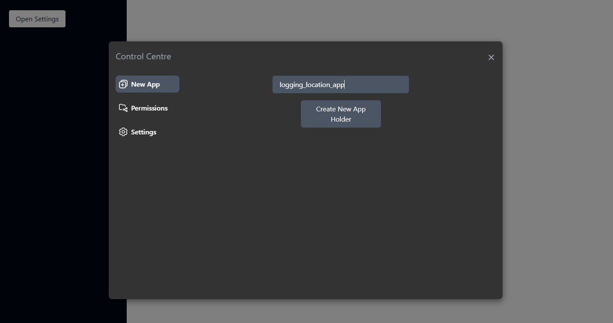

# Location Tracker App

Tahle aplikace je součástí bakalářské práce decentralizovaného systému pro správu dat.

Podrobnejší popis o daném systému je v hlavním README tohoto celého projektu.

### Popis 

V hlavním systému si uživatel vytvoří nový holder pro novou aplikaci. Nazve si ji a dostane token, pomocí kterého se pak tahle lokalizační aplikace asociuje s tym holderom v systéme. 




Uživatel pak zadá IP adresu systému spolu s portem. Aplikace je implementována tak, aby uživatel musel nejprve zkontrolovat jestli je daný systém dosažitelný před samotným zadáním asociovačného tokenu.
    

<div style="text-align: center;">
    
    
    
</div>


Po úspěšné asociaci je uživatovi zobrazeno tlačítko po pokračování v registraci. Aplikace pri úšpěšné asociaci dostane od systému token, ktorý pak použije pro vytvoření profilů a pro žádání přístupů k datům (i cizím) v systému.

Aplikace ještě zažádá o přístup k notifikacím mobiliního telefonu, k přístupu ku poloze, i k poloze na pozadí a na závěr ješte požádá o to, aby nebyla zahrnuta v zozname aplikací, které operační systém omezuje kvůli šetření baterie.

Při requestování přístupu k poloze se nejprve requestuje poloha jako taková a pak poloha na pozadí. Jelikož ale poloha na pozadí přebije polohu jako takovou, je uživatel vyhozen do nastavení mobiliního telefonu, kde to musí manuálně nastavit.

V případě, že aplikace by nepožádala o výnímku šetření baterie, zbírání polohy na pozadí by probíhalo málo, nebo na základě extenzivního testování vůbec. Tato požadavka jde ale přímo proti zásadám android play storeu a teda taková appka má problém byt published.

<div style="text-align: center;">
    
</div>

Následně musí aplikace zaregistrovat profil v daném systému s použití daného tokenu.
Profil obsahuje json schému ukazující, jak budou dané data vypadat.

Json schéma, kterou aplikace registruje je následující:
```json
{
  "type": "object",
  "properties": {
    "latitude": {
      "type": "number",
      "minimum": -90,
      "maximum": 90
    },
    "longitude": {
      "type": "number",
      "minimum": -180,
      "maximum": 180
    },
    "accuracy": {
      "type": "number"
    },
    "altitude": {
      "type": "number"
    },
    "speed": {
      "type": "number"
    },
    "speedAccuracyMetersPerSecond": {
      "type": "number"
    },
    "time": {
      "type": "number"
    }
  },
  "required": [
    "latitude",
    "longitude",
    "accuracy",
    "altitude",
    "speed",
    "speedAccuracyMetersPerSecond",
    "time",
  ],
  "additionalProperties": false
}
```
<div style="text-align: center;">
    
    
</div>

Následně aplikace pomocí tokenu požádá o přístup zapisovat data do systému.

<div style="text-align: center;">
    
</div>

Po úšpěšném požádání je uživatel informován, že aplikace musí mít danou žádost odobrenou v systému před tím, než bude moci poslat data.

<div style="text-align: center;">
    
    
</div>

Uživatel je přivítán v nové aplikaci. 

Aplikace zobrazuje následovní informace:
- kdy proběhla poslední synchronizace
- Informace o poslední synchronizaci
- Počet lokací, které zatím nebyly synchronizované
- Nejstarší nesynchronizovaná location
- Celkový počet již synchronizovaných lokací


<div style="text-align: center;">
    
    
</div>

V aplikaci je možné nastavit, od kdy do kdy chce uživatel, aby aplikace sbírala data. Mimo tohto období appka nezbírá polohu, no sleduje, jestli není uživatel připojen ke správní síti pro možnost synchronizace dat.

Co se týče automatického synchronizování dat, je tu připraven switch, kterým si uživatel volí, jestli takovou automatickou synchronizaci chce mít.

Následujou informace o názvu sítě, adrese a porte systému.

Pokud uživatel nechce mít data synchronizované automaticky, má na výběr dvě veci:
- Synchronizovat data se serverem manuálně - stlačením tlačítka `Sync Now` 
- nebo exportem dat do `csv` souboru.


<div style="text-align: center;">
  

  
</div>

Při synchronizaci je uživatelovi ukazován progress bar spolu s percetom samotného procesu synchronizace.

Ve spodní části aplikace hlavní obrazovky teda vídíme 3 horizontálne tlačítka:
- Tlačítko na zobrazení seznamu nazbíraných dat
- Tlačítko na export do csv (uživatelovi se zobrazí screen, kde si vybere místo uložení a název souboru)
- Zapnutí samotné služby na zběr dat. Tato služba musí být zapnutá pro zběr dat. Po zapnutí služby(`foreground service`) je stále možné měnit například automatickú synchronizaci nebo název sítě bez toho, aby musela být service restartována. Teda aplikace s ní umí komunikovat a posílat jí data nejen při její spuštění.

Dále je tam tam vedle `Network for synchronisation` šedé tlačítko, které přesměruje uživatele na samostatnou screen, kde se dá změnit název síte a adresa/port systému.

Z tohohle místa je pak možné i celou aplikaci resetovat do původního stavu.

<div style="text-align: center;">
    
    
    
</div>

`Foreground service` musí mít pro správne fungování persistentní notifikaci, která neustále informuje uživatele, jestli je úspěšně aktívna, nebo v případě neaktivního období (mimo časového intervalu zběru dat zvoleného uživatelem) informuje, kdy jsou aktivní hodiny.

<div style="text-align: center;">
    


</div>

Na závěr je ješte vidět obrazovku, která poskytuje seznam dat. K této aplikaci se dá projit z tlačítka `Show Data` na hlavní obrazovke.


<div style="text-align: center;">
    
</div>

Všechny http requesty jsou plně funknční kromě http requestu na poslání lokačních dat. Je tam jenom mockup, který simuluje zpoždění síti. Samotná synchronizace je ale plně funkční - do http requestovací synchronizační funkce je posíláno postupně 1000 lokací, aby request nebyl příliš velký a procento úspěchu je takisto správně updateováno.
